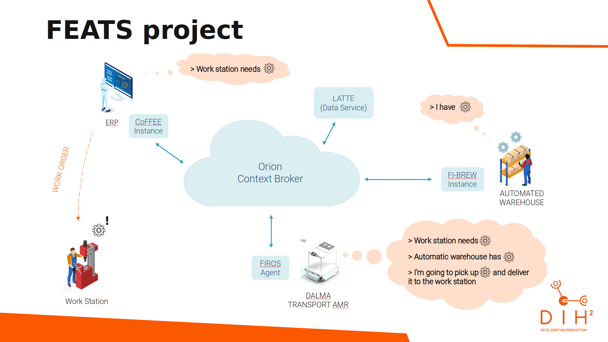

# Architecture

FI-BREW is a component of FEATS, and its main goal is to integrate with an automatic warehouse. Currently the only supported integration is with [Modula](https://www.modula.eu/) Lift.
FI-BREW reads work order information from the Orion Context Broker and informs the warehouse about the next batch of raw material that needs to be retrieved. Using this information, the warehouse builds a list of the required material and presents it to warehouse operator, who then only needs to press a button in order to confirm the operation.
The following picture shows the architecture of FEATS, where FI-BREW is integrated:

## FEATS Components Architecture

In order to easily integrate any FEATS component with Orion Context Broker, an API was created that works as proxy between all components and Orion. This means that all components of FEATS (CoFFEE, LATTE and FI-BREW) communicate with the broker API (proxy), that converts internal FEATS business models into Orion models, in order to communicate with Orion. These Orion models are the [FIWARE's Smart Data Models](https://www.fiware.org/developers/smart-data-models).

## Code Architecture

All FEATS components are Java Spring Boot applications, and the code is always organized with the following layers:
- web
- service
- interface
- base

The "web" layer is where the REST endpoints are exposed. The "service" layer contains all the business logic. The "interface" layer contains all the internal and external [DTOs](https://java-design-patterns.com/patterns/data-transfer-object/). And the "base" layer contains all base classes and plugins configurations useful for the remaining layers.

### Broker API

The broker API source code (`broker-api`) is structured into five Java projects:
- web
- service
- interface
- fiware
- base

The "fiware" layer contains all the logic to communicate with Orion. Contains all the Smart Data Models used by FEATS, between them the warehouse, material, workstation and work orders (all used by FI-BREW), and also the connector to Orion, plublishers and subscribers.
The Orion connector is where all the HTTP calls to Orion are performed (regardless of the HTTP method). The publisher and subscriber define all the instructions to write/read to/from Orion.

This api currently is an independent component, but can easily be inserted inside 
FI-BREW has just one component (through [maven dependency](https://maven.apache.org/guides/introduction/introduction-to-dependency-mechanism.html)). It was structured in this way, as an independent component, to have the possibility of independent deployment. In this way it is possible to implement some improvement in broker api, and all FEATS components automatically have that improvement deploying just this api - avoid the need of deploy all components, one by one.

### FI-BREW API

The FI-BREW API source code (`fibrew-api`) is also structured into five Java projects:
- web
- service
- interface
- orm
- base

The "orm" layer is responsible for mapping the object model to the relational model. This is needed since FI-BREW writes the work order information to a SQL table on the automatic warehouse software. 

